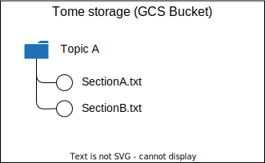

# Knowledge Base
The Knowledge Base is the storage that contains all the knowledge information that Tome will use for the Q&A Quiz. 

The Knowledge Base (kb) is structured as follows:

> That means that given a topic **with code** `topica` and a section **with code** `sectionx` they will be found under the **GCS Bucket** in the folder `kb/topica/sectiona.txt`. 

## Codes instead of Ids
One of the decisions I made was to not use `ObjectId`-like ids to name the folders and files of the Knowledge Base.  
I've chosen that to make the GCS folder actually humanly understandable, since I might not initially have any automation in storing the files in the kb. 

That of course means that **the codes must be unique**.  
And the responsibility of finding unique codes is the user's. 